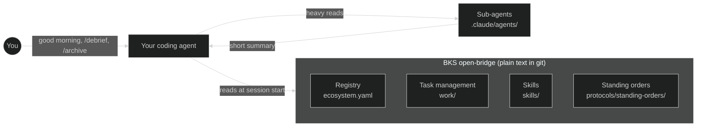

# BKS open-bridge

**A plain-text git repo your coding agent reads at session start, so it already knows your repos, your clients, and what you shipped yesterday.** Claude Code, Codex or Copilot CLI stops re-asking every morning. It is markdown and YAML in a repo you own: no database, no SaaS, no second app. The BKS-Lab team runs its own work on it every day ([status](#status)).

[](LICENSE)
[](TRADEMARK.md)
[](CONTRIBUTING.md#developer-certificate-of-origin-dco)
[](https://github.com/bks-lab/open-bridge/actions/workflows/validate.yml)
[](https://github.com/bks-lab/open-bridge/releases)

```
> good morning

Morning. You're mid-incident on bigcorp: Stripe webhook retries are
failing in prod (P1, opened yesterday). Root cause traced to the
webhook secret; next step is the retry fix. startupxyz onboarding:
email-verification wired, 6 tests green. Board: 2 doing · 1 review ·
cart-a11y waits on PR #214.
```

That is the shipped demo workspace answering. The clip below is its `/briefing` dashboard; the [full live session](https://bks-lab.github.io/open-bridge/demo.html) adds the morning session start, an incident taken from log triage to a tested fix, and first-run onboarding.

[](https://bks-lab.github.io/open-bridge/demo.html)

## Who it is for

- **For** people who run several clients, repos or roles with a coding agent, from a solo operator wearing several hats to a small consultancy.
- **For** anyone tired of re-explaining who they are, which client they are on, and what happened yesterday, every session, in every tool.
- **Not for** a single-repo project: the coordination layer is overhead you will not use.
- **Not for** people who want a hosted app. There is nothing to host; the value is files your agent reads.

## Try it in 2 minutes

The repo ships a runnable demo ([`examples/agency/`](examples/agency/)): a fictional two-client agency with a filled board, two days of logged work, and a P1 incident in flight. You need an agent CLI, for example `npm install -g @anthropic-ai/claude-code`.

```bash
git clone https://github.com/bks-lab/open-bridge.git
cd open-bridge/examples/agency && claude    # or: codex, copilot
```

Ask `good morning`, then `where was I on the payment retry?` and `why is the cart task in review?`. Everything it answers is read from plain markdown in that folder: open `work/log.md` next to it and the trick disappears. Do not `git push` from this clone; it points at the public repo.

One person wearing several hats (a consultancy partner who is also a freelancer, with a household and a home server)? [`examples/portfolio/`](examples/portfolio/) is that shape: three personas, a managed client service, life admin, and digests that stay silent until something is red.

<a id="get-started"></a>

## Set it up

Your data needs a private home before you write any of it: your own private repo becomes `origin`, BKS open-bridge stays a read-only `upstream`. The easiest way is to let your agent do it.

<details>
<summary><b>Paste this into Claude Code, Codex or Copilot CLI</b></summary>

```text
Set up BKS open-bridge for me: https://github.com/bks-lab/open-bridge
(plain-text memory for coding agents; the full steps are in its docs/install.md).
Before you touch anything: check git and gh, ask me what to call my private
copy (default: my-bridge), show me your plan and wait for my go. Then:
1. git clone https://github.com/bks-lab/open-bridge.git <name> && cd <name>
   git remote rename origin upstream
   gh repo create <me>/<name> --private --source=. --remote=origin --push
   (no gh: ask me to create an empty PRIVATE repo, then add it as origin)
2. ./bin/setup                  (native Windows: bin/setup.ps1)
3. printf 'repo: <me>/<name>\nis_public: false\n' > .bridge-origin
4. Show me: git remote -v, git config core.hooksPath, cat .bridge-origin
5. Tell me to restart you inside <name>. The new session greets me and
   offers the setup lanes; if not, run /bridge-onboard.
Never push anything to bks-lab/open-bridge, never write a secret into a file,
ask me before anything destructive.
```

The longer prompt, with the reasoning behind each step, is in [docs/install.md](docs/install.md).

</details>

By hand, in three lines: clone and re-home the remotes (`git remote rename origin upstream`, then create your private `origin`); run `./bin/setup` to arm the push guard; start a **new** agent session inside the folder and run `/bridge-onboard`. Setup always ends with that restart, because a session only loads the skills of the folder it started in. Commands, the template-button caveat and which tools are tested: [docs/install.md](docs/install.md).

## What you get

Four pieces do the daily work:

| Piece | What it is |
|---|---|
| **Registry** | `ecosystem.yaml`: your repos, clients and workspaces in one file, read as a table of contents with one entry fetched on demand ([context-index](docs/context-index.md)) |
| **Task management** | `work/`: one folder per task with a `STATUS.md`, a generated board, and an append-only daily log ([work-system](docs/work-system.md)) |
| **Skills** | one `skills/` tree of plain-language verbs (`/briefing`, `/debrief`, `/archive`, …) that every supported tool loads ([commands](docs/commands.md)) |
| **Standing orders** | always-on rules in [`protocols/standing-orders/`](protocols/standing-orders/README.md), loaded every session and scoped per sub-agent |

And capabilities you switch on when you need them:

| Capability | One line |
|---|---|
| [Org overlays](docs/org-overlays.md) | subscribe to your organisation's shared config by git URL, without a fork |
| [Workloads](docs/workloads.md) | one file per scheduled job or daemon on your machines, checked against the live service manager |
| [Secrets](docs/secrets.md) | reference URIs instead of values, and a skill that resolves them without printing them |
| [Memory](docs/memory.md) | durable facts as one file each, versioned with the rest of the instance |
| [Tracker sync](skills/tracker-sync/SKILL.md) | reconcile tasks with GitHub Project boards, gated, never automatic |
| [Meeting debrief](docs/transcription-worker.md) | transcript to protocol, proposed tasks and a draft recap mail |
| [Bridge-Agents](agents/README.md) | a persistent A2A endpoint that fronts a persona to the outside world, under a human gate |
| [Workspaces](docs/workspaces.md) | bind the repos and config overlays one engagement touches into a named container |
| [Learning loop](docs/skill-learnings.md) | lessons land in the skill they concern; improvement proposals wait for your review in `/bridge-learn` |
| [Where things live](docs/where-things-live.md) | a question in your own words on the left, the file that answers it on the right |

## A day with it

Five moments from a long-running instance, told generically.

**Morning triage.** "good morning" returns one list: a client's overnight error report has two new failure clusters, a backup target is three days stale, a tax document is due Friday, two applications have had no reply for over ten days. Nothing else is shown, because the rest is green. ([`briefing`](skills/briefing/SKILL.md))

**After a call.** The recording becomes a transcript, the transcript a protocol in the team wiki, three proposed board items waiting for your approval, and a recap mail as a draft. The agent does not send it; you press send. ([`debrief`](skills/debrief/SKILL.md), [transcription worker](docs/transcription-worker.md))

**An incident without context loss.** "What happened to invoice X?" A sub-agent searches the logs and returns a short delta table instead of a log dump. The finding lands in the task's `STATUS.md` and a log row, so tomorrow's session resumes mid-thought. ([sub-agents](.claude/agents/archivist.md), [task management](docs/work-system.md))

**The quiet server.** Dozens of declared jobs run on a small home server. The agent never trusts a status field; it asks the service manager, and only a broken or stale job becomes a morning line with a fix hint. ([workloads](docs/workloads.md), [deploy reconciliation](rules/deploy-reconciliation.md))

**Wearing another hat.** Switching to a freelance client swaps the signature, the filing path and the board. A private task never syncs to any tracker, because its `STATUS.md` says `bridge_only: true`. ([personas](docs/personas.md), [task sync](protocols/standing-orders/task-sync.md))

## How it works

```
your-bridge/
├── ecosystem.yaml             registry: repos, clients, workspaces
├── identity/                  WHO am I, to WHOM do I send
├── infra/                     WHERE runs what, HOW to reach it
├── workflow/                  WHAT happens when (contexts, projects)
├── skills/                    the verbs, one tree for every tool
├── protocols/standing-orders/ always-on rules
└── work/
    ├── board.md               generated task board
    ├── log.md                 daily work log
    ├── tasks/bigcorp-api-payment-retry/STATUS.md
    ├── tasks/startupxyz-onboarding/STATUS.md
    ├── streams/               long-running, never "done"
    └── done/2026-06/          closed, archived monthly
```

The tree above stops at what a fresh instance edits day to day. It omits the
tooling and reference layers, `bin/`, `scripts/`, `docs/`, `examples/`,
`themes/`, `trackers/`, `rules/` and `agents/`, laid out in
[docs/structure.md](docs/structure.md).

A task's `STATUS.md` starts with YAML frontmatter ([template](work/templates/STATUS.md), [schema](work/templates/_schema.status.yaml)); `status` is a closed enum (`backlog`, `doing`, `review`, `done`):

```yaml
---
slug: bigcorp-api-payment-retry
type: incident
status: doing
priority: P1
created: 2026-06-23
last_updated: 2026-06-24
headline: "Stripe webhook signatures failing in prod (P1)"
sync:
  bridge_only: false
  github: { repo: acme-dev/bigcorp-issues, issues: [142] }
---
```

A log row uses one frozen format, `| YYYY-MM-DD HH:MM | glyph | context | what |`:

```markdown
| 2026-06-24 14:30 | 📝 | bigcorp | logged the Stripe webhook-secret root cause + next steps in the task STATUS |
```

<a id="sub-agents"></a>



**CORE and USER, in five lines.** CORE (skills, rules, scripts, docs, templates) ships on the default branch and updates for everyone. Your data (config, tasks, logs, personas, references to credentials) lives on your own `user/{name}` branch. The two touch disjoint paths, so `git merge upstream/main` does not meet your edits ([updating](docs/updating.md)). Your branch goes only to your private `origin`; a `pre-push` guard ([push-guard](rules/push-guard.md)) blocks it from a public remote. Generic improvements flow back through `/bridge-promote` as fork PRs, routed by each file's `scope:` ([extension model](docs/extension-model.md)).

Sub-agents (Claude Code) take heavy reads out of the main session and return a summary; one reference sub-agent ships in [`.claude/agents/`](.claude/agents/archivist.md). What a session loads before its first answer has a declared budget that CI enforces: [docs/context-index.md](docs/context-index.md).

## Why not just a CLAUDE.md?

A `CLAUDE.md` is one flat instruction sheet. A Bridge is a structured workspace that keeps a work record across sessions, keeps clients apart, and takes template updates without touching your data.

| | a `CLAUDE.md` | memory-MCP server | Notion/Linear + MCP | BKS open-bridge |
|---|---|---|---|---|
| Survives across sessions | partly: static instructions | yes | yes | yes |
| Plain files you own, diffable, no lock-in | yes | usually a DB or vendor store | no, SaaS | yes |
| Same context in Claude Code, Codex, Copilot CLI | partly | per-tool wiring | per-tool wiring | yes: one `skills/` tree |
| Shipped work structure (board, log, task status) | no | no | you build it yourself | yes |
| Separate per-client worlds | no | no | manual discipline | yes: one instance per client |
| Safety gates written in (propose-confirm, push guard) | no | no | no | yes |

## Safety

- **Propose, then confirm.** The agent proposes, you decide. Changes to its own configuration go through a human gate.
- **Outward and destructive actions are gated per action.** Sending a message, merging a PR, deleting, rotating a credential: each needs an explicit yes.
- **Secrets never live in the repo.** Only reference URIs; the values stay in your vault, and CI checks for committed secrets ([secrets](docs/secrets.md)).
- **The substrate itself sends nothing.** No telemetry, no analytics, no hosted service. What does leave your machine is what you use or wire up: your model provider sees the session, and an overlay sync, a tracker sync or a Bridge-Agent talks to the endpoints you configure.
- **It is inspectable.** `cat` exactly what the agent reads; its memory is a git history you own. These are conventions the agent follows, not an OS sandbox: read them in [`AGENTS.md`](AGENTS.md) and adapt them.

<a id="status"></a>

## Status

Early and newly public. BKS open-bridge is used every day by the BKS-Lab team on its own instances, and besides those there are closed instances run for other companies. Every merge to `main` ships as its own release ([releasing.md](docs/releasing.md)), so the version number moves fast by design; it tracks merges, not maturity. What is proven, what is still a bet, and what is open lives in one place: [ROADMAP.md](ROADMAP.md). React on the issues you want most; that is how priorities get decided. Found a rough edge? [Open an issue](https://github.com/bks-lab/open-bridge/issues).

## Returning?

- [docs/where-things-live.md](docs/where-things-live.md): which file answers your question
- [docs/commands.md](docs/commands.md): the CORE commands
- [docs/README.md](docs/README.md): the full docs index
- [docs/updating.md](docs/updating.md): pulling CORE and overlay updates, by hand or unattended
- [docs/feature-tour.md](docs/feature-tour.md): create your first X after onboarding
- [Changelog](https://bks-lab.github.io/open-bridge/changelog.html) and [releases](https://github.com/bks-lab/open-bridge/releases)

## Contributing

See [`CONTRIBUTING.md`](CONTRIBUTING.md). Contribute from your private instance, never from a public fork you onboarded into. Build something generic on CORE, then run `/bridge-contribute` (files) or `/bridge-promote` (commits): it routes by `scope:`, runs the mandatory content-safety scan, and opens a fork-based PR with a DCO sign-off (`git commit -s`). `scope: user` content never goes anywhere public.

## License, trademark, acknowledgments

Code and content are [MIT](LICENSE). A separate [trademark policy](TRADEMARK.md) covers the name `BKS open-bridge` and the logo, because licenses cover copyright, not brands. Copyright (c) 2026 BKS-Lab (Boiman Kupermann Solutions GmbH) and Contributors. Provided as-is, without warranty.

BKS open-bridge draws on a large body of public work; named inspirations are in [ACKNOWLEDGMENTS.md](ACKNOWLEDGMENTS.md).
