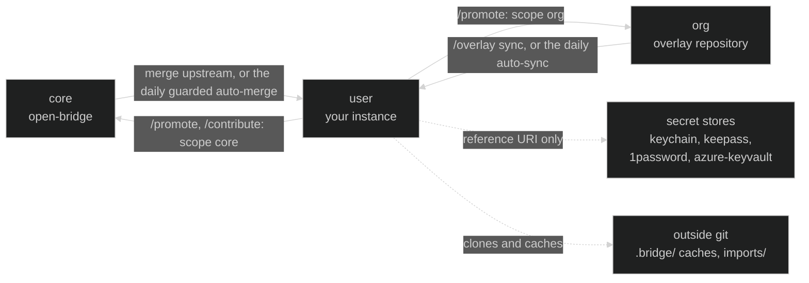

# Data model

The layout of a Bridge is described in four places, each from its own angle:
[`structure.md`](structure.md) (the tree), [`extension-model.md`](extension-model.md)
(CORE and USER), [`org-overlays.md`](org-overlays.md) (the organisation layer) and
[`context-index.md`](context-index.md) (what a session reads first). This page is
the one picture across all four, for anyone about to add an object type or trying
to see where a piece of data belongs.

It answers four questions: which data is core, which is per organisation and which
is per user; which objects live in each of those islands; how they reference each
other; and in which kind of store each one lives. The tables below are generated
from [`data-model.yaml`](data-model.yaml), and `python3 scripts/data-model.py`
holds that file to the tree: every config family the tree has appears in it
exactly once.

## Three islands

| Island | Where it lives | What it holds |
|---|---|---|
| **core** | `bks-lab/open-bridge`, the default branch | Templates, schemas, skills, rules, docs and scripts. Ships to every instance. |
| **org** | an organisation's overlay repository | Shared contexts, project boards, recipient groups, org skills and rules, an ecosystem fragment. Materialized into each member's instance. |
| **user** | the instance's `user/<name>` branch, on a private origin | Every entry under the cluster wrappers, `work/`, `bridge-config.yaml`, the registry. Never reaches a public upstream. |

Which island a file belongs to is decided by where it lives, not by a tag you can
forget: the folder, the `_` prefix of templates and schemas, and a `scope:` field
only where a folder cannot say it (skills, rules, sub-agents). The rules are in
`AGENTS.md`, section "Scope: structural, not declarative".

## How data moves between the islands

- **core to user.** `git merge upstream/main`, or `scripts/upstream-autoupdate.sh`
  as a daily job that merges only when a clean tree and a conflict-free
  `git merge-tree` allow it.
- **org to user.** `scripts/overlay.py sync`, or `scripts/overlay-autosync.sh`
  unattended: configuration and updates to files already accepted are applied, a
  behavioural file arriving for the first time waits for one explicit yes, and a
  conflict with a local edit or a deletion holds the overlay for a person.
- **user to core or org.** `/promote` and `/contribute` route every file by its
  island, through a content scan that refuses personal data
  (`rules/promote-safety.md`).
- **secrets.** An entry holds a reference URI, never a value
  (`rules/secret-placement.md`). The value stays in its store.

## What a session reads, and when

A session does not read the whole tree. It reads a small, measured set before its
first answer, and opens everything else when the work names it. The ring in the
concept section of the [landing page](https://bks-lab.github.io/open-bridge/#concept)
draws exactly this, from the same file as the tables below:

1. **The centre** is the session.
2. **The first ring** is what every session reads before its first answer. Its size
   has a declared ceiling in `context-budget.yaml`, enforced by
   `scripts/measure-context.py`.
3. **The second ring** holds the config families, one dot each. A filled dot means
   something of that family is read at session start (a listing, an index, a slice);
   a hollow dot means it is opened when the work names it.
   `scripts/check-reachability.py` makes sure every family is at least named where
   a session will see it, so "when named" never turns into "never".
4. **Beyond it** are the references between entries (`persona_ref`, `context_ref`,
   `remote_ref` and the rest), the path the agent walks after the first hop.
   `scripts/check-edges.py` holds each one to resolving.
5. **Outside the dashed line** is what never enters git: secret stores and object
   stores, reached by URI, and local caches. Why content that is not
   configuration gets a store of its own: [`object-store.md`](object-store.md).

## The tables

<!-- data-model:table:start (generated by scripts/data-model.py from docs/data-model.yaml; edit the yaml, then run it with --write) -->
#### Read before the first answer

| Item | What it is |
|---|---|
| AGENTS.md | The operating manual, @-imported through CLAUDE.md (or the tool's own wrapper). |
| SOUL/IDENTITY | identity/agent/SOUL.md and IDENTITY.md, @-imported once onboarding has seeded them. |
| config slice | `python3 scripts/bridge-config.py --session`: the six bridge-config.yaml blocks a session needs; the others are read by the skill that owns them. |
| registry card | `python3 scripts/context-index.py ecosystem.yaml`: the settings plus one line per entry; an entry itself comes with `--get <name>` (docs/context-index.md). |
| order index | `python3 scripts/standing-orders.py --index`, plus the bodies of the orders marked `load: eager`. |
| log + board | `python3 scripts/worklog.py --recent 3` and work/board.md, never the whole log. |
| skill list | Name and description of every skill, injected by the harness (measured as listing:skills). |
| agent list | Name and description of every sub-agent, injected by the harness (measured as listing:agents). |

#### The config families

| Family | One entry is | Island | Lives in | References | Written by | Read |
|---|---|---|---|---|---|---|
| `identity/accounts/` | a cloud tenant, subscription or secret-store reference | core: template, schema; user: entries | open-bridge (CORE) instance data | `persona_ref` → identity/personas/ `*_ref` → a secret store, by URI | a person; onboarding may suggest the first | when named |
| `identity/agent/` | this orchestrator's own name, role and voice | core: templates, soul deck; user: SOUL.md, IDENTITY.md | open-bridge (CORE) your user branch | none | onboarding seeds it; accepted /bridge-learn lessons fold into SOUL.md | at session start |
| `identity/contracts/` | a recurring obligation the user holds: utility, telco, insurance, subscription | core: template, schema; user: entries | open-bridge (CORE) your user branch | `delivery_address_ref` → identity/personas/ | a person | when named |
| `identity/mandants/` | a group that receives outgoing messages | core: template, schema; user: entries; org: a shared group via scope | open-bridge (CORE) instance data | `context_ref` → workflow/contexts/ | /mandants | when named |
| `identity/personas/` | an identity the user holds: signature, tax data, filing paths | core: template, schema; user: entries | open-bridge (CORE) instance data | `mandant_refs` → identity/mandants/ | a person; onboarding may seed the first | when named |
| `identity/vehicles/` | a vehicle the user owns or leases, and the persona that bears it | core: template, schema; user: entries | open-bridge (CORE) your user branch | `persona` → identity/personas/ `refs` → identity/contracts/ | a person | when named |
| `infra/backups/` | what is backed up where, and whether it is fresh | core: template, schema; user: topology.yaml, _state.yaml | open-bridge (CORE) your user branch | `remote_ref` → infra/remotes/ | topology by a person; _state.yaml only by the backup executor an instance brings | when named |
| `infra/channels/` | an outbound transport: mail, chat, bot, digest | core: template, schema; user: entries | open-bridge (CORE) your user branch | `runtime.remote` → infra/remotes/ | /channel | when named |
| `infra/instances/` | another Bridge this one should know about | core: template, schema; user: entries | open-bridge (CORE) your user branch | `location.host` → infra/remotes/ `promote_config_ref` → bridge-config.yaml upstreams | a person; the overlay engine keeps subscribes_overlays current | when named |
| `infra/remotes/` | a machine: ssh, wake, services | core: template, schema; user: entries | open-bridge (CORE) instance data | `layout_ref` → infra/backups/ | /remote | when named |
| `infra/secret-stores/` | where a secret lives, who reaches it, which kind belongs in it | core: template, schema; user: entries | open-bridge (CORE) your user branch | `unlock.password_ref` → another store, by URI `remote_ref` → infra/remotes/ `account_ref` → identity/accounts/ | /secrets | when named |
| `infra/object-stores/` | where content that is not configuration lives, who reaches it, which class belongs in it | core: template, schema; user: entries | open-bridge (CORE) your user branch | `credentials.*_ref` → a secret store, by URI `reachable_from.machines` → infra/remotes/ | a person; /object-store reads it | when named |
| `infra/transcriptions/` | where recordings become transcripts, and where those land | core: template, schema; user: topology.yaml | open-bridge (CORE) your user branch | `worker host` → infra/remotes/ | the meeting-transcription skill | when named |
| `infra/utilities/` | a supply connection at a location: power, gas, water, heat | core: template; user: entries | open-bridge (CORE) your user branch | `portal_password_ref` → a secret store, by URI | a person | when named |
| `workflow/calendars/` | a scheduled outbound action: what, to whom, when | core: template, schema; user: entries.yaml | open-bridge (CORE) instance data | `recipients` → identity/mandants/ | /calendar | when named |
| `workflow/contexts/` | where a piece of work gets documented | core: template, schema; user: entries; org: shared contexts via scope | open-bridge (CORE) instance data org overlay | `persona_ref` → identity/personas/ | a person, or an org overlay | when named |
| `workflow/projects/` | a board's field values and state map, read before any tracker call | core: template, schema; user or org: entries | open-bridge (CORE) instance data org overlay | `context_ref` → workflow/contexts/ `mandant_ref` → identity/mandants/ | a person, or an org overlay; board items only through github-projects-manager | when named |
| `workflow/workloads/` | one declared run on one machine | core: template, schema, contract tests; user: entries | open-bridge (CORE) your user branch | `placement.host` → infra/remotes/ `persona_ref` → identity/personas/ `response.recipients` → identity/mandants/ `response.notify_via` → infra/channels/ | /workload | when named |
| `workflow/workspaces/` | a named binding of code repos and config overlays | core: template, schema; user: entries | open-bridge (CORE) your user branch outside git | `overlays` → overlays.lock.yaml `repos` → a code repository, cloned under .bridge/ | /workspace (scripts/workspace.py) | when named |
| `rules/` | a guardrail, tiered by folder | core: rules/*.md; org: rules/org/; user: rules/user/ | open-bridge (CORE) org overlay your user branch | none | a person; scripts/validate-bridge.py holds each rule's scope to its folder | at session start |
| `protocols/standing-orders/` | an always-on rule, loaded while task management is enabled | core: *.md; user: user/ | open-bridge (CORE) your user branch | none | a person | at session start |
| `skills/` | a packaged procedure: SKILL.md plus its references/ | any tier, set by metadata.scope | open-bridge (CORE) org overlay your user branch | none | a person or an agent; scripts/validate-skill-scope.py holds the tier | at session start |
| `trackers/` | a provider playbook that normalizes a tracker's output | core only; per-instance settings live in bridge-config.yaml | open-bridge (CORE) | none | CORE maintainers | when named |
| `themes/` | a vocabulary set for user-facing words | core: the built-ins; user: a custom theme | open-bridge (CORE) your user branch | none | a person | when named |
| `.claude/agents/` | a sub-agent, spawned inside a session for heavy or parallel work | any tier, set by scope | open-bridge (CORE) your user branch | none | a person | at session start |
| `work/` | the work system: tasks, streams, log, board, memory | user, the whole folder | your user branch | none | scripts/worklog.py, scripts/gen-board.py, and the skills that write a STATUS.md | at session start |

#### Beside the families

| File | What it is | Island | Lives in |
|---|---|---|---|
| `bridge-config.yaml` | the instance's settings; a session reads six of its blocks | user | instance data |
| `ecosystem.yaml` | the repo registry, read as a card with one entry on demand | user | instance data |
| `ecosystem.<name>.yaml` | a registry fragment, for example an organisation's | org or user | instance data org overlay |
| `overlays.lock.yaml` | which overlay files were materialized, at which revision | user | instance data |
| `context-budget.yaml` | the declared ceiling for what every session reads | core | open-bridge (CORE) |
| `context-budget.user.yaml` | an instance's own caps for its own always-on files | user | instance data |
| `DESIGN.md` | the design tokens every generated visual reads | core | open-bridge (CORE) |
| `.bridge/` | the overlay cache, the workspace clones and the object read cache | user | outside git |
| `imports/` | incoming files before they are filed | user | outside git |
| `object://<store>/<key>` | content that is not configuration: recordings, filed documents, exports | user | an object store |

#### The stores

| Lives in | Meaning |
|---|---|
| open-bridge (CORE) | Tracked in open-bridge and shipped to every instance on the next merge. |
| your user branch | Tracked on the instance's own user/* branch, which only ever goes to a private origin (rules/push-guard.md). |
| instance data | Personal or instance-specific data. Ignored by the shipped .gitignore for every clone; a private origin re-allows it by writing negation files (scripts/user-data.py arm), then commits it with the rest of your work. |
| org overlay | Materialized from an organisation's overlay repository and recorded in overlays.lock.yaml (docs/org-overlays.md). |
| outside git | Never in a repository: a secret store reached by URI (rules/secret-placement.md), or a local cache or clone under .bridge/. |
| an object store | Never in a repository: bytes an entry reaches by an object:// reference, through a declaration in infra/object-stores/ (docs/object-store.md). A local directory can be one. |
<!-- data-model:table:end -->

## Adding an object type

1. Create the family folder with its `_template.yaml` (and `_schema.yaml` where
   entries are validated), following `rules/file-creation.md`.
2. Describe it in `docs/data-model.yaml`. A family only your instance has goes into
   `work/data-model.yaml` instead, in the same shape: `work/` is USER by folder, so
   the row never promotes and a fork can describe its own families without touching
   a CORE file.
3. Run `python3 scripts/data-model.py --write` to regenerate the tables and the ring,
   then name the family where a session will find it (`scripts/check-reachability.py`
   says where that is).

`python3 scripts/data-model.py` fails when a family has no row, when one has two,
when a row names a folder the tree does not have, and when either generated block
was edited by hand. `--mutate` proves each of those checks can fail.
